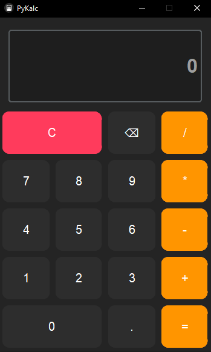

# 🧮 PyKalc

A clean, dark-mode calculator built with Python and CustomTkinter.


## ✨ Features
- Clean dark mode interface
- Basic operations (+, -, *, /)
- Backspace button
- Error handling (e.g. division by zero)

## 📸 Screenshot


## 🚀 How to Run

**Option 1 - As Python Script**
```bash
pip install -r requirements.txt
python PyKalc.py
```

**Option 2 - Standalone Executable**
Download the latest `.exe` from [Releases](../../releases) and run it.

## 🛠️ Tech Stack
- Python
- CustomTkinter

## 📄 License
This project is open source and available under the MIT License.
